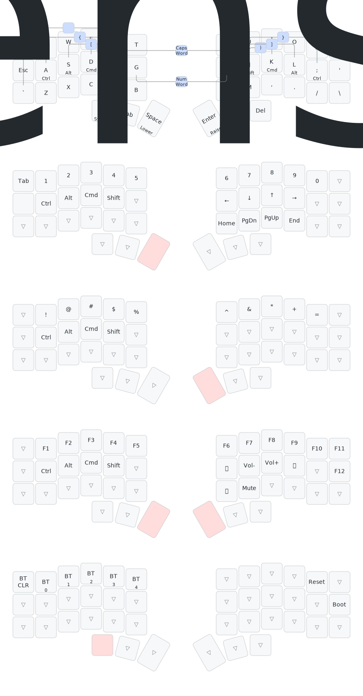

# ZMK Corne Config

Typeractive Corne 42-key wireless keyboard, nice!nano v2 controllers, ZMK firmware, macOS + US layout.

## Keymap



## Key Position Reference

```
╭──────┬──────┬──────┬──────┬──────┬──────╮   ╭──────┬──────┬──────┬──────┬──────┬──────╮
│  0   │  1   │  2   │  3   │  4   │  5   │   │  6   │  7   │  8   │  9   │  10  │  11  │
├──────┼──────┼──────┼──────┼──────┼──────┤   ├──────┼──────┼──────┼──────┼──────┼──────┤
│  12  │  13  │  14  │  15  │  16  │  17  │   │  18  │  19  │  20  │  21  │  22  │  23  │
├──────┼──────┼──────┼──────┼──────┼──────┤   ├──────┼──────┼──────┼──────┼──────┼──────┤
│  24  │  25  │  26  │  27  │  28  │  29  │   │  30  │  31  │  32  │  33  │  34  │  35  │
╰──────┴──────┴──┬───┴──┬───┴──┬───┴──────╯   ╰──────┴───┬──┴──┬───┴──┬───┴──────┴──────╯
                  │  36  │  37  │  38  │           │  39  │  40  │  41  │
                  ╰──────┴──────┴──────╯           ╰──────┴──────┴──────╯
```

## Layers

### Layer 0 — Base (QWERTY + Home Row Mods)

```
╭──────┬──────┬──────┬──────┬──────┬──────╮   ╭──────┬──────┬──────┬──────┬──────┬──────╮
│ Tab  │  Q   │  W   │  E   │  R   │  T   │   │  Y   │  U   │  I   │  O   │  P   │  -   │
├──────┼──────┼──────┼──────┼──────┼──────┤   ├──────┼──────┼──────┼──────┼──────┼──────┤
│ Esc  │A/Ctrl│S/Alt │D/Cmd │F/Shft│  G   │   │  H   │J/Shft│K/Cmd │L/Alt │;/Ctrl│  '   │
├──────┼──────┼──────┼──────┼──────┼──────┤   ├──────┼──────┼──────┼──────┼──────┼──────┤
│  `   │  Z   │  X   │  C   │  V   │  B   │   │  N   │  M   │  ,   │  .   │  /   │  \   │
╰──────┴──────┴──┬───┴──┬───┴──┬───┴──────╯   ╰──────┴───┬──┴──┬───┴──┬───┴──────┴──────╯
                  │Esc/L4│ Tab  │Spc/L1│           │Ent/L2│ Bksp │ Del  │
                  ╰──────┴──────┴──────╯           ╰──────┴──────┴──────╯
```

- Home row mods: CTRL/ALT/GUI/SHIFT mirrored on ASDF and JKL;
- All LEFT modifiers on both sides (avoids AltGr on US International)
- Thumb hold-taps: Esc→System, Space→Lower, Enter→Raise
- Bksp and Del are plain keys (hold-repeatable)
- Tri-layer: hold Space (L1) + Enter (L2) together → Adjust (L3)

### Layer 1 — Lower (Numbers + Navigation)

```
╭──────┬──────┬──────┬──────┬──────┬──────╮   ╭──────┬──────┬──────┬──────┬──────┬──────╮
│ Tab  │  1   │  2   │  3   │  4   │  5   │   │  6   │  7   │  8   │  9   │  0   │      │
├──────┼──────┼──────┼──────┼──────┼──────┤   ├──────┼──────┼──────┼──────┼──────┼──────┤
│ Esc  │ Ctrl │ Alt  │ Cmd  │Shift │      │   │  ←   │  ↓   │  ↑   │  →   │      │      │
├──────┼──────┼──────┼──────┼──────┼──────┤   ├──────┼──────┼──────┼──────┼──────┼──────┤
│      │      │      │      │      │      │   │ Home │PgDown│ PgUp │ End  │      │      │
╰──────┴──────┴──┬───┴──┬───┴──┬───┴──────╯   ╰──────┴───┬──┴──┬───┴──┬───┴──────┴──────╯
                  │      │      │ ████ │           │      │      │      │
                  ╰──────┴──────┴──────╯           ╰──────┴──────┴──────╯
```

### Layer 2 — Raise (Symbols)

```
╭──────┬──────┬──────┬──────┬──────┬──────╮   ╭──────┬──────┬──────┬──────┬──────┬──────╮
│      │  !   │  @   │  #   │  $   │  %   │   │  ^   │  &   │  *   │  +   │  =   │      │
├──────┼──────┼──────┼──────┼──────┼──────┤   ├──────┼──────┼──────┼──────┼──────┼──────┤
│      │ Ctrl │ Alt  │ Cmd  │Shift │      │   │      │      │      │      │      │      │
├──────┼──────┼──────┼──────┼──────┼──────┤   ├──────┼──────┼──────┼──────┼──────┼──────┤
│      │      │      │      │      │      │   │      │      │      │      │      │      │
╰──────┴──────┴──┬───┴──┬───┴──┬───┴──────╯   ╰──────┴───┬──┴──┬───┴──┬───┴──────┴──────╯
                  │      │      │      │           │ ████ │      │      │
                  ╰──────┴──────┴──────╯           ╰──────┴──────┴──────╯
```

### Layer 3 — Adjust (F-keys + Media) — via tri-layer (L1 + L2)

```
╭──────┬──────┬──────┬──────┬──────┬──────╮   ╭──────┬──────┬──────┬──────┬──────┬──────╮
│      │  F1  │  F2  │  F3  │  F4  │  F5  │   │  F6  │  F7  │  F8  │  F9  │ F10  │ F11  │
├──────┼──────┼──────┼──────┼──────┼──────┤   ├──────┼──────┼──────┼──────┼──────┼──────┤
│      │ Ctrl │ Alt  │ Cmd  │Shift │      │   │  ⏮   │ Vol- │ Vol+ │  ⏭   │      │ F12  │
├──────┼──────┼──────┼──────┼──────┼──────┤   ├──────┼──────┼──────┼──────┼──────┼──────┤
│      │      │      │      │      │      │   │  ⏯   │ Mute │      │      │      │      │
╰──────┴──────┴──┬───┴──┬───┴──┬───┴──────╯   ╰──────┴───┬──┴──┬───┴──┬───┴──────┴──────╯
                  │      │      │ ████ │           │ ████ │      │      │
                  ╰──────┴──────┴──────╯           ╰──────┴──────┴──────╯
```

### Layer 4 — System (Bluetooth)

```
╭──────┬──────┬──────┬──────┬──────┬──────╮   ╭──────┬──────┬──────┬──────┬──────┬──────╮
│BT CLR│ BT0  │ BT1  │ BT2  │ BT3  │ BT4  │   │      │      │      │      │Reset │      │
├──────┼──────┼──────┼──────┼──────┼──────┤   ├──────┼──────┼──────┼──────┼──────┼──────┤
│      │      │      │      │      │      │   │      │      │      │      │      │ Boot │
├──────┼──────┼──────┼──────┼──────┼──────┤   ├──────┼──────┼──────┼──────┼──────┼──────┤
│      │      │      │      │      │      │   │      │      │      │      │      │      │
╰──────┴──────┴──┬───┴──┬───┴──┬───┴──────╯   ╰──────┴───┬──┴──┬───┴──┬───┴──────┴──────╯
                  │ ████ │      │      │           │      │      │      │
                  ╰──────┴──────┴──────╯           ╰──────┴──────┴──────╯
```

Layers 5–7 are reserved for ZMK Studio runtime customization.

## Combos

All combos are layer 0 only, 40ms timeout, 80ms prior-idle guard.

| Combo | Keys | Output | Pattern |
|-------|------|--------|---------|
| ( | D + F | `(` | Adjacent |
| ) | J + K | `)` | Adjacent |
| [ | S + F | `[` | Skip one |
| ] | J + L | `]` | Skip one |
| { | A + F | `{` | Wide span |
| } | J + ; | `}` | Wide span |
| Caps Word | F + J | Caps Word | Index fingers |

## Building

Push to `main` — GitHub Actions builds firmware automatically. Download `.uf2` artifacts from the [Actions tab](../../actions).

## Flashing

1. Connect nice!nano via USB
2. Double-tap the reset button — a USB drive appears
3. Copy the `.uf2` file to the drive
4. Flash left half first, then right half
